# Documentación de Ingeniería de Software – RF1 a RF6 (FASE I–IV)

## FASE I – Requerimientos

### Propósito y alcance del módulo IA
El módulo IA de FCC habilita la consulta y asesoramiento institucional mediante un chatbot integrado con OpenAI y una base de conocimiento interna. Incluye ingestión de documentos, recuperación de contexto (RAG), registro de historial y generación de reportes, además de procesos de capacitaciones y asesoramiento virtual interno. 

### Problema que resuelve en FCC
Centraliza el acceso a información institucional, acelera la resolución de trámites y procesos internos, y permite trazabilidad/auditoría de consultas, además de gestionar capacitación interna y externa.

### Módulos involucrados
- **IA Cliente**: interfaz para carga de documentos, historial y asesoramiento.
- **Chatbot Servidor**: RAG, embeddings, consultas internas.
- **OpenAI**: generación de respuestas y embeddings.
- **Reportes**: exportación de historial IA (CSV).
- **Capacitaciones**: CRUD de procesos formativos.

### Tabla de Requerimientos Funcionales (RF)
| ID | Nombre | Descripción | Actor | Prioridad | Dependencias | Estado |
|---|---|---|---|---|---|---|
| RF1 | Integración OpenAI | Enlazar chatbot servidor con OpenAI para procesamiento/respuesta | Usuario interno / Sistema | Alta | OpenAI API | Implementado |
| RF2 | Respuesta a cliente | Entregar respuesta del chatbot servidor al cliente interno/usuario | Usuario interno | Alta | RF1 | Implementado |
| RF3 | Ingestión documental | Enlazar archivos institucionales para entrenamiento/automatización | Administrador | Alta | Almacenamiento + Embeddings | Implementado |
| RF4 | Reportes IA | Emitir reportes individuales, generales y personalizados | Administrador | Media | Historial IA | Implementado |
| RF5 | Capacitaciones | Gestionar procesos de capacitación internos/externos | Administrador | Media | Módulo Capacitaciones | Implementado |
| RF6 | Asesoramiento virtual | Asesoría sobre procesos y trámites internos | Usuario interno | Alta | RF1 + RF3 | Implementado |

### Fichas de especificación por RF
#### RF1 – Integración OpenAI
- **Versión**: 1.0  
- **Fecha**: 2025-02-02  
- **Autores**: Equipo FCC / IA  
- **Fuentes**: API OpenAI, Servicios IA internos  
- **Descripción**: El servidor IA consulta OpenAI para generar respuestas y embeddings.  
- **Actores**: Usuario interno, Servidor IA  
- **Precondición**: API Key configurada; servicio activo.  
- **Secuencia normal**:  
  1. Usuario envía consulta.  
  2. Servidor llama OpenAI con prompt/contexto.  
  3. Recibe respuesta y la retorna al cliente.  
- **Postcondición**: Respuesta entregada al usuario.  
- **Excepciones**: Error de red/clave inválida → respuesta de error.  
- **Prioridad/Estabilidad**: Alta / Estable  

#### RF2 – Respuesta a cliente
- **Versión**: 1.0  
- **Fecha**: 2025-02-02  
- **Autores**: Equipo FCC / IA  
- **Fuentes**: Chatbot servidor  
- **Descripción**: La respuesta generada se canaliza al cliente interno.  
- **Actores**: Usuario interno  
- **Precondición**: RF1 disponible.  
- **Secuencia normal**:  
  1. Cliente envía consulta.  
  2. Recibe respuesta del servidor.  
  3. Muestra en UI.  
- **Postcondición**: Respuesta visible en chat.  
- **Excepciones**: Timeout/500.  
- **Prioridad/Estabilidad**: Alta / Estable  

#### RF3 – Ingestión documental
- **Versión**: 1.0  
- **Fecha**: 2025-02-02  
- **Autores**: Equipo FCC / IA  
- **Fuentes**: PDFs institucionales  
- **Descripción**: Subida de documentos, extracción de texto, chunking y embeddings.  
- **Actores**: Administrador  
- **Precondición**: Documento PDF válido.  
- **Secuencia normal**:  
  1. Admin sube PDF.  
  2. Se extrae texto y se fragmenta.  
  3. Se generan embeddings.  
  4. Se guarda en BD.  
- **Postcondición**: Documento indexado.  
- **Excepciones**: PDF sin texto → error.  
- **Prioridad/Estabilidad**: Alta / Estable  

#### RF4 – Reportes IA
- **Versión**: 1.0  
- **Fecha**: 2025-02-02  
- **Autores**: Equipo FCC / IA  
- **Fuentes**: Historial IA  
- **Descripción**: Reportes filtrados con exportación CSV.  
- **Actores**: Administrador  
- **Precondición**: Historial disponible.  
- **Secuencia normal**:  
  1. Aplicar filtros.  
  2. Consultar historial.  
  3. Exportar CSV.  
- **Postcondición**: Reporte descargado.  
- **Excepciones**: Sin datos → CSV vacío.  
- **Prioridad/Estabilidad**: Media / Estable  

#### RF5 – Capacitaciones
- **Versión**: 1.0  
- **Fecha**: 2025-02-02  
- **Autores**: Equipo FCC  
- **Fuentes**: Módulo Capacitaciones  
- **Descripción**: CRUD de procesos formativos.  
- **Actores**: Administrador  
- **Precondición**: Usuario admin autenticado.  
- **Secuencia normal**:  
  1. Crear/editar capacitación.  
  2. Guardar en BD.  
  3. Listar y gestionar.  
- **Postcondición**: Capacitaciones registradas.  
- **Excepciones**: Campos requeridos vacíos.  
- **Prioridad/Estabilidad**: Media / Estable  

#### RF6 – Asesoramiento virtual
- **Versión**: 1.0  
- **Fecha**: 2025-02-02  
- **Autores**: Equipo FCC / IA  
- **Fuentes**: RAG interno  
- **Descripción**: Asesoramiento con contexto institucional.  
- **Actores**: Usuario interno  
- **Precondición**: Documentos indexados.  
- **Secuencia normal**:  
  1. Usuario consulta.  
  2. Servidor recupera contexto.  
  3. OpenAI responde.  
  4. UI muestra resultado.  
- **Postcondición**: Consulta resuelta.  
- **Excepciones**: Sin contexto → respuesta genérica.  
- **Prioridad/Estabilidad**: Alta / Estable  

### Requisitos no funcionales (IA)
- **Seguridad**: Token API, control de acceso por roles, auditoría de consultas.  
- **Privacidad**: Evitar exposición de PII en exportaciones; aplicar masking si aplica.  
- **Rendimiento**: Tiempo de respuesta del chat < 5s promedio.  
- **Disponibilidad**: Reintentos o mensajes de fallback si OpenAI falla.  
- **Trazabilidad**: Registrar preguntas, contexto y respuestas.  

### Requisitos de usuario vs sistema
**Usuario**: “Quiero consultar trámites y recibir respuesta clara.”  
**Sistema**: “Debe vectorizar, consultar contexto, auditar, y enviar respuesta.”  

### User stories por RF
- **RF1**: “Como usuario interno, quiero enviar una consulta al chatbot para recibir respuesta basada en OpenAI y documentos institucionales.”  
- **RF2**: “Como usuario interno, quiero ver la respuesta en el cliente inmediatamente.”  
- **RF3**: “Como administrador, quiero cargar documentos para que el asistente aprenda.”  
- **RF4**: “Como administrador, quiero exportar el historial en CSV.”  
- **RF5**: “Como administrador, quiero registrar capacitaciones internas y externas.”  
- **RF6**: “Como usuario interno, quiero asesoría virtual sobre procesos.”  

## FASE II – Análisis

### Diagrama de Secuencia 1: Consulta ciudadana (OpenAI público)
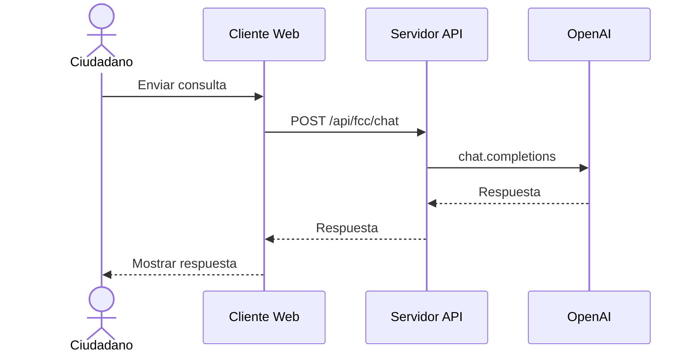
**Explicación**: El ciudadano consulta desde el cliente público. El servidor canaliza a OpenAI y retorna la respuesta. Flujo alterno: error de OpenAI → mensaje de error.

### Diagrama de Secuencia 2: Consulta interna + RAG
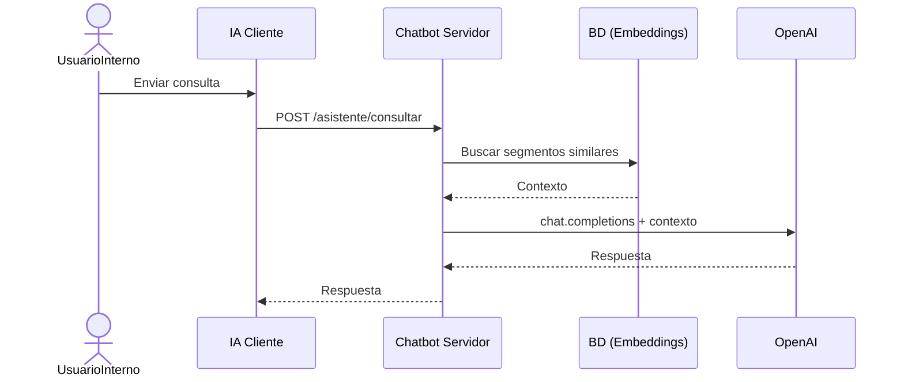
**Explicación**: El chatbot interno consulta contexto vectorial antes de invocar OpenAI. Flujo alterno: sin contexto → respuesta general.

### Diagrama de Secuencia 3: Indexación de documento
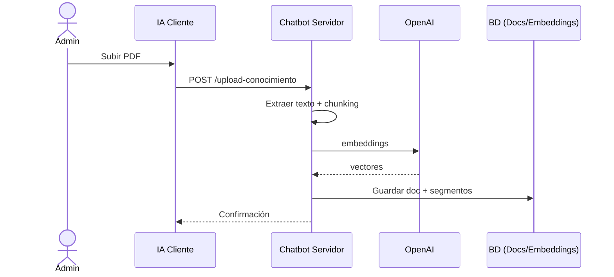
**Explicación**: El documento se procesa y se indexa en BD.

### Actividades (2)
**Actividad 1 – Indexación**
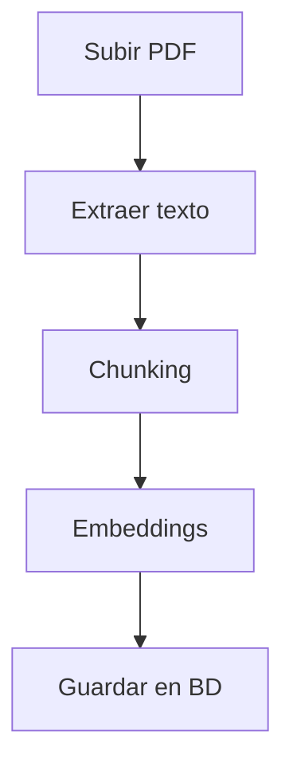
**Actividad 2 – Consulta interna**
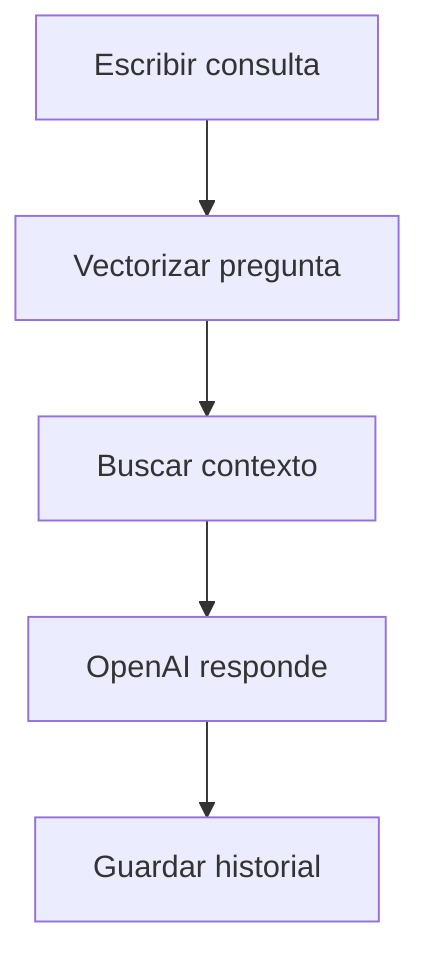

### Estados (Documento IA)
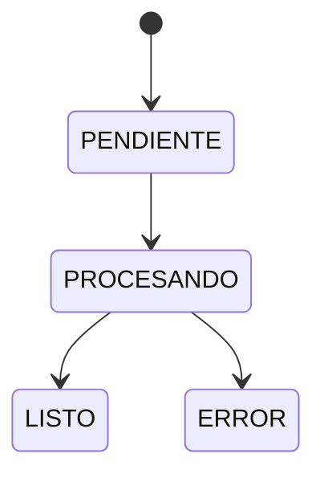
**Explicación**: Un documento pasa por estados hasta quedar listo o fallido.

### Macroproceso (end-to-end)
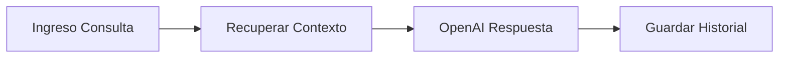
**Explicación**: Flujo principal de asesoramiento y trazabilidad.

## FASE III – Diseño

### Entidades (MER/CDM/PDM)
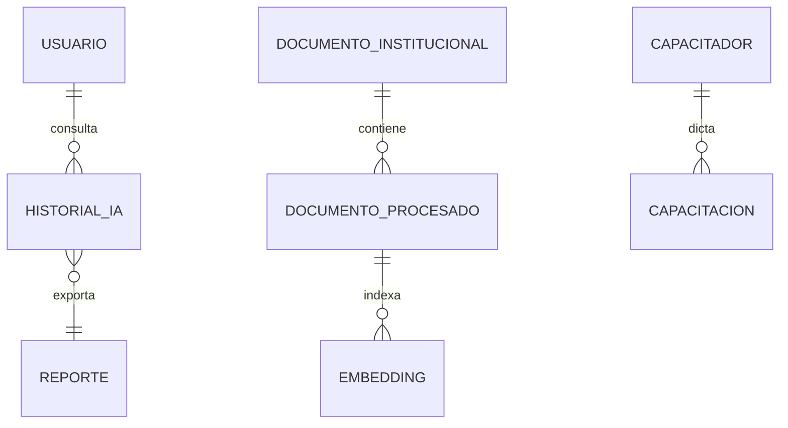

### Clases/Servicios sugeridos
- **PromptBuilder**
- **RetrievalService**
- **OpenAIClient**
- **ReportService**

## FASE IV – Construcción

### Diagrama de Paquetes
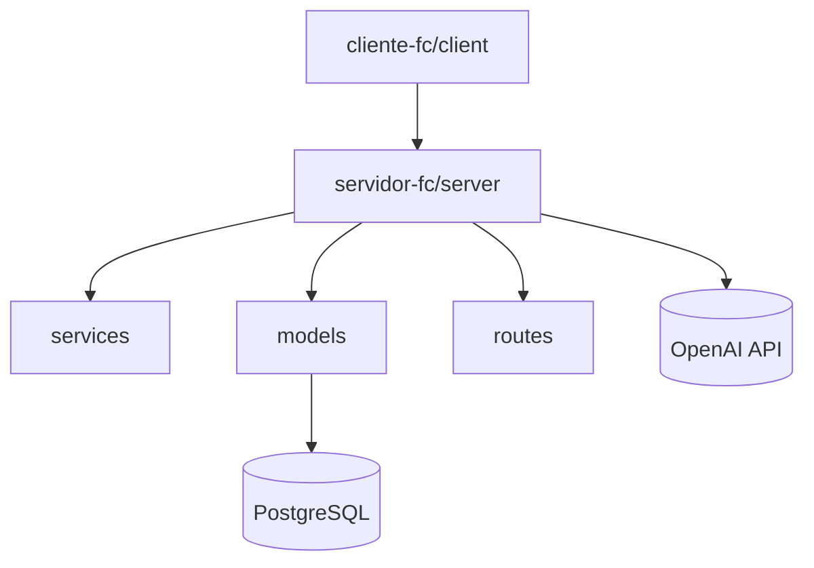

### Diagrama de Arquitectura
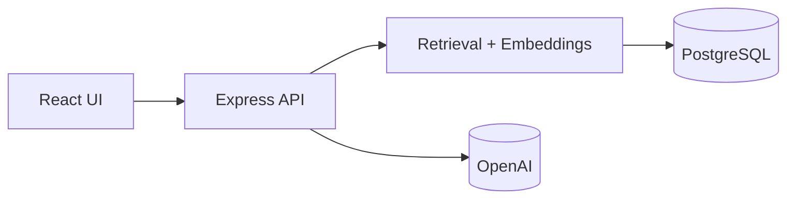

### Diagrama de Despliegue
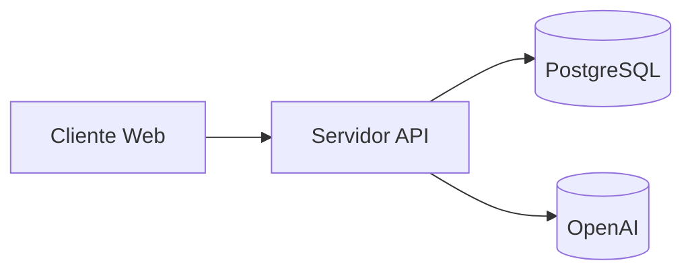

### Diagrama de Componentes
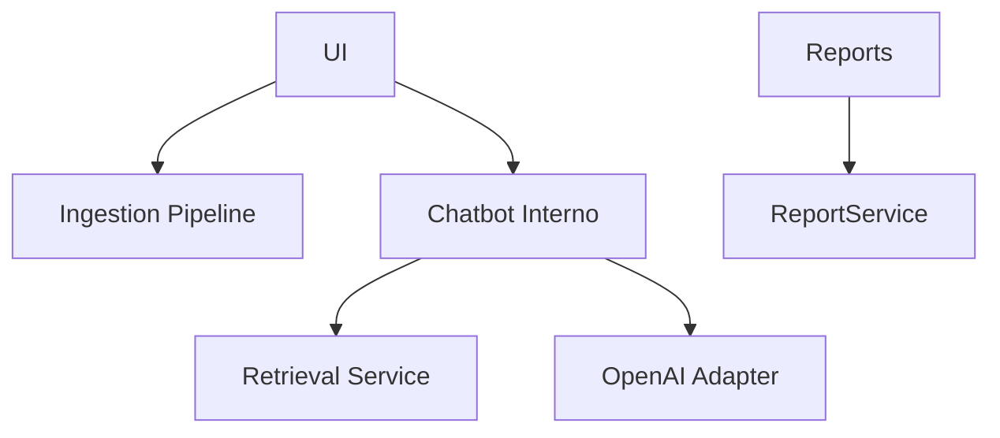
